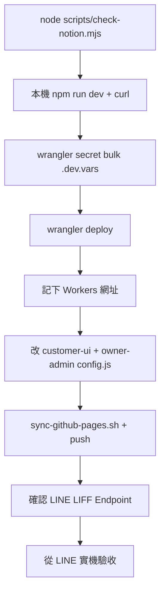

# Cursor 任務包：Cloudflare Workers 正式部署前檢查

> **專案**：`beauty-studio-booking`  
> **檔案**：`TASK-cloudflare-deploy-check.md`  
> **建立日期**：2026-07-13  
> **狀態**：待執行（本文件僅整理流程，**不執行部署**）

---

## 1. 目前已完成狀態

依專案 `main` 分支現況（2026-07-13）：

| 項目 | 狀態 | 說明 |
|------|------|------|
| 後端 API | ✅ | Cloudflare Workers，`backend/src/index.js` |
| Owner API 安全驗證 | ✅ | Phase 1：`liff-verify.js` + `requireOwnerFromRequest` |
| 業主前端帶 ID Token | ✅ | Phase 2：`owner-admin/js/api.js` + `liff-init.js` |
| Notion 四表 | ✅ | services / slots / bookings / settings |
| Notion 連線檢查腳本 | ✅ | `node scripts/check-notion.mjs` 四表 OK |
| 本機 `.dev.vars` | ✅ | Token、Database ID、OWNER、LIFF_CHANNEL_ID 已填 |
| 本機 `npm run dev` | ✅ | `/api/health` → `notion: true` |
| LIFF ID（前端） | ✅ | `2010678480-dKQ3afnw`（customer + owner config） |
| `API_BASE_URL` | ❌ | 仍為 `請填入 Cloudflare Workers API 網址` |
| Cloudflare 正式部署 | ❌ | 尚未 `wrangler deploy` |
| Cloudflare Secrets（正式） | ❌ | 尚未上傳 |
| GitHub Pages `docs/` API 網址 | ❌ | 待部署後填入並 sync |

### 相關文件

| 文件 | 用途 |
|------|------|
| `product-docs/CLIENT-NOTION-SETUP-FLOW.md` | Notion 建表 |
| `product-docs/CLIENT-LINE-SETUP-FLOW.md` | LINE / LIFF |
| `product-docs/CLIENT-DELIVERY-CHECKLIST.md` | 交付驗收 |
| `TASK-owner-api-auth.md` | Owner 後端安全 Phase 1 |
| `TASK-owner-api-auth-phase2.md` | Owner 前端 Token Phase 2 |
| `scripts/check-notion.mjs` | Notion 只讀檢查 |

---

## 2. 部署前必檢項目

### A. 帳號與專案

- [ ] 已有 Cloudflare 帳號並可登入 [dash.cloudflare.com](https://dash.cloudflare.com)
- [ ] 已安裝 Wrangler 並登入：`npx wrangler login`
- [ ] 確認 Workers 方案可部署（免費方案即可測試）

### B. Notion

- [ ] `node scripts/check-notion.mjs` 四表全部 **OK**
- [ ] 四個資料庫均已連接 Integration
- [ ] `settings` 至少有一筆預設資料

### C. LINE

- [ ] LIFF ID 已填入 `customer-ui/js/config.js`、`owner-admin/js/config.js`
- [ ] `LIFF_CHANNEL_ID` 已記錄（= LINE Channel ID，**不是** LIFF ID）
- [ ] `OWNER_LINE_USER_IDS` 已記錄業主 LINE userId
- [ ] LIFF Endpoint URL 已規劃為 GitHub Pages 網址（部署前端後設定）

### D. 機密安全

- [ ] `backend/.dev.vars` **未** commit 到 Git
- [ ] `git status` 無 `.dev.vars` 出現
- [ ] 前端 `config.js` **無** Notion Token / Channel Secret

### E. 程式碼

- [ ] `node --check backend/src/index.js` 通過
- [ ] `node --check backend/src/owner-auth.js` 通過
- [ ] `node --check backend/src/liff-verify.js` 通過

### F. 前端（部署 API 後再做）

- [ ] `API_BASE_URL` 將改為正式 Workers 網址
- [ ] 執行 `./scripts/sync-github-pages.sh`
- [ ] 更新 HTML 中 `?v=` 版本號（避免 LINE 快取）

---

## 3. Cloudflare Secrets 需要設定的值

正式環境透過 **Secrets** 存放，不寫在 `wrangler.toml`。

| Secret 名稱 | 來源 | 說明 |
|-------------|------|------|
| `NOTION_TOKEN` | Notion Integration → Internal Integration Secret | BeautyBookingDemo API |
| `NOTION_DATABASE_SERVICES` | services 資料庫網址最後 32 字元 | |
| `NOTION_DATABASE_SLOTS` | slots 資料庫 ID | |
| `NOTION_DATABASE_BOOKINGS` | bookings 資料庫 ID | |
| `NOTION_DATABASE_SETTINGS` | settings 資料庫 ID | |
| `OWNER_LINE_USER_IDS` | 業主 LINE userId | 可多個，逗號分隔 |
| `LIFF_CHANNEL_ID` | LINE Developers → Channel → Basic settings → Channel ID | 純數字 |

### 非 Secret（可寫在 `wrangler.toml` [vars]）

| 變數 | 目前值 | 說明 |
|------|--------|------|
| `STUDIO_NAME` | `美業工作室` | 僅 `/api/health` 顯示用 |

### 上傳方式（擇一）

**方式 A：一次上傳（建議，從本機 `.dev.vars`）**

```bash
cd backend
npx wrangler secret bulk .dev.vars
```

> 僅上傳 `.dev.vars` 內有的 key；`STUDIO_NAME` 若在 `.dev.vars` 沒有，仍由 `wrangler.toml` 提供。

**方式 B：逐個上傳**

```bash
cd backend
npx wrangler secret put NOTION_TOKEN
npx wrangler secret put NOTION_DATABASE_SERVICES
npx wrangler secret put NOTION_DATABASE_SLOTS
npx wrangler secret put NOTION_DATABASE_BOOKINGS
npx wrangler secret put NOTION_DATABASE_SETTINGS
npx wrangler secret put OWNER_LINE_USER_IDS
npx wrangler secret put LIFF_CHANNEL_ID
```

### 驗證 Secrets 已設定

```bash
cd backend
npx wrangler secret list
```

應看到上述 7 個名稱（值不會顯示）。

---

## 4. 哪些值不可放前端、不可 commit

| 資料 | 可放前端 config.js | 可 commit Git | 正確存放 |
|------|-------------------|---------------|----------|
| `NOTION_TOKEN` | ❌ | ❌ | Cloudflare Secret |
| 四個 `NOTION_DATABASE_*` | ❌ | ❌ | Cloudflare Secret |
| `OWNER_LINE_USER_IDS` | ❌ | ❌ | Cloudflare Secret |
| `LIFF_CHANNEL_ID` | ❌ | ❌ | Cloudflare Secret |
| `backend/.dev.vars` 全文 | ❌ | ❌ | 僅本機 |
| `LIFF_ID` | ✅ | ✅ | `config.js` |
| `API_BASE_URL` | ✅ | ✅ | `config.js`（公開網址） |
| `STUDIO_NAME` | — | ✅ | `wrangler.toml` |

---

## 5. `wrangler deploy` 前要跑的檢查

在 `backend/` 目錄依序執行：

### 步驟 1：Notion 連線

```bash
cd /path/to/beauty-studio-booking
node scripts/check-notion.mjs
```

預期：四表 OK，exit 0。

### 步驟 2：語法檢查

```bash
node --check backend/src/index.js
node --check backend/src/owner-auth.js
node --check backend/src/liff-verify.js
```

### 步驟 3：本機 API 煙霧測試

```bash
cd backend
npm run dev
```

另開終端：

```bash
curl -s http://127.0.0.1:8787/api/health
curl -s http://127.0.0.1:8787/api/services
curl -s http://127.0.0.1:8787/api/settings
```

> 注意：本機埠號以 wrangler 顯示為準（可能是 8787 或其他）。

### 步驟 4：確認 Git 乾淨

```bash
git status
```

確認 `.dev.vars` 未 staged。

### 步驟 5：上傳 Secrets（首次部署必做）

```bash
cd backend
npx wrangler secret bulk .dev.vars
```

### 步驟 6：部署（本任務包不執行，僅記錄指令）

```bash
cd backend
npx wrangler deploy
```

記下輸出網址，例如：

```
https://beauty-studio-api.<subdomain>.workers.dev
```

---

## 6. 部署後要測哪些 API

將 `API_BASE` 換為正式 Workers 網址。

### 公開 API（不需 Authorization）

```bash
export API_BASE="https://beauty-studio-api.xxxxx.workers.dev"

curl -s "$API_BASE/api/health"
curl -s "$API_BASE/api/services"
curl -s "$API_BASE/api/settings"
```

### Owner API（需 Bearer ID Token）

```bash
# 從業主 LIFF 頁 Console：liff.getIDToken()
export OWNER_ID_TOKEN="eyJ..."

curl -s -H "Authorization: Bearer $OWNER_ID_TOKEN" \
  "$API_BASE/api/owner/today"

curl -s -H "Authorization: Bearer $OWNER_ID_TOKEN" \
  "$API_BASE/api/owner/services"
```

### 安全回歸（應失敗）

```bash
# 無 token 應 401
curl -s -w "\nHTTP %{http_code}\n" \
  "$API_BASE/api/owner/today?userId=Ufake"

# 無效 token 應 401
curl -s -w "\nHTTP %{http_code}\n" \
  -H "Authorization: Bearer invalid" \
  "$API_BASE/api/owner/services"
```

### 部署後檢查表

| API | 預期 |
|-----|------|
| GET `/api/health` | `ok: true`, `notion: true` |
| GET `/api/services` | JSON 陣列 |
| GET `/api/settings` | 含 `brandName` |
| GET `/api/owner/today` + Bearer | 200（業主 token） |
| GET `/api/owner/today` 無 Bearer | 401 |

---

## 7. `API_BASE_URL` 要如何填入

部署成功後，Wrangler 會顯示 Workers 網址，例如：

```
https://beauty-studio-api.gosu-chill-book.workers.dev
```

### 要改的檔案（兩處必須一致）

**1. `customer-ui/js/config.js`**

```javascript
window.BEAUTY_CONFIG = {
  LIFF_ID: "2010678480-dKQ3afnw",
  API_BASE_URL: "https://beauty-studio-api.xxxxx.workers.dev"
};
```

**2. `owner-admin/js/config.js`**

```javascript
window.BEAUTY_CONFIG = {
  LIFF_ID: "2010678480-dKQ3afnw",
  API_BASE_URL: "https://beauty-studio-api.xxxxx.workers.dev"
};
```

### 注意

- **不要**尾端加 `/`
- **不要**用 `localhost` 給正式 LIFF 用
- 改完後必須 sync 到 `docs/`（見第八節）

### `docs/` 對應位置（sync 後自動更新）

| 原始檔 | sync 後 |
|--------|---------|
| `customer-ui/js/config.js` | `docs/js/config.js` |
| `owner-admin/js/config.js` | `docs/owner/js/config.js` |

**不要手改 `docs/`**，改 `customer-ui` / `owner-admin` 再 sync。

---

## 8. docs 同步流程

```bash
cd /path/to/beauty-studio-booking

# 1. 確認 customer-ui、owner-admin 的 config.js 已填入 API_BASE_URL
# 2. 建議更新 index.html、my-line-id.html 的 ?v= 版本號

./scripts/sync-github-pages.sh

# 3. 確認同步結果
diff -qr customer-ui docs | grep -v owner || true
diff -qr owner-admin docs/owner

# 4. 推送（由執行者決定時機）
git add customer-ui owner-admin docs
git commit -m "chore: 設定正式 API_BASE_URL 並同步 docs"
git push
```

### GitHub Pages 設定

| 項目 | 值 |
|------|-----|
| Branch | `main` |
| 資料夾 | `/docs` |
| 客人端網址 | `https://<username>.github.io/beauty-studio-booking/` |
| 業主端網址 | `https://<username>.github.io/beauty-studio-booking/owner/` |

### LINE LIFF Endpoint

部署前端後，到 LINE Developers 確認 LIFF Endpoint URL 與 GitHub Pages **完全一致**（含尾端 `/`）。

---

## 9. 驗收標準

### 後端部署驗收

- [ ] `npx wrangler deploy` 成功，有正式 Workers 網址
- [ ] `npx wrangler secret list` 含 7 個 secrets
- [ ] 正式 `/api/health` → `notion: true`
- [ ] 正式 `/api/services`、`/api/settings` 可讀
- [ ] Owner API 無 Bearer → 401
- [ ] Owner API + 有效 Bearer + 白名單 → 200

### 前端驗收

- [ ] `customer-ui`、`owner-admin` 的 `API_BASE_URL` 已改為正式網址
- [ ] `docs/` 已 sync，與原始檔一致
- [ ] GitHub Pages 可開啟客人端、業主端
- [ ] 從 LINE LIFF 開啟可預約、可進管理頁

### 安全驗收

- [ ] `.dev.vars` 未 commit
- [ ] 前端無 Token / Secret
- [ ] `config.js` 僅含 `LIFF_ID` + `API_BASE_URL`

---

## 10. Rollback 方式

### 回復後端（Workers）

```bash
cd backend
# 查看部署紀錄
npx wrangler deployments list

# 若需回復程式碼
git checkout <previous-commit> -- src/
npx wrangler deploy
```

Secrets 通常**不需刪除**；回復舊版程式碼後重新 deploy 即可。

### 回復前端 API 網址

```bash
git checkout <previous-commit> -- customer-ui/js/config.js owner-admin/js/config.js
./scripts/sync-github-pages.sh
git push
```

### 回復 Secrets（僅在填錯時）

```bash
cd backend
npx wrangler secret put NOTION_TOKEN   # 重新輸入正確值
# 或重新 bulk
npx wrangler secret bulk .dev.vars
npx wrangler deploy
```

### 不需 rollback 的項目

- Notion 資料（部署不應改動）
- LINE LIFF ID（除非換 Channel）

---

## 11. 常見錯誤排查

### `API token is invalid`

| 可能原因 | 處理 |
|----------|------|
| `NOTION_TOKEN` 錯誤或過期 | 到 Notion Integrations 重新複製 Secret |
| 正式環境 Secret 未上傳 | `npx wrangler secret bulk .dev.vars` + redeploy |
| 本機改了 `.dev.vars` 未重啟 dev | 重啟 `npm run dev` |
| Token 與資料庫 Integration 不一致 | 確認四表都連接同一 Integration |

檢查指令：

```bash
node scripts/check-notion.mjs
```

---

### `404 Not Found`（API 路徑）

| 可能原因 | 處理 |
|----------|------|
| `API_BASE_URL` 尾端多 `/` 或路徑打錯 | 應為 `https://xxx.workers.dev`，路徑 `/api/health` |
| Workers 未部署成功 | 重新 `wrangler deploy` |
| 用了錯誤的 Workers 網址 | 對照 Cloudflare Dashboard → Workers 網址 |

---

### `404`（Notion Database）

| 可能原因 | 處理 |
|----------|------|
| Database ID 錯誤 | 重抄 Notion 網址最後 32 字元 |
| Integration 未連接資料庫 | 各表 ··· → 連接 |
| 正式 Secret 仍是 placeholder | 重新上傳 secrets |

`check-notion.mjs` 會標明哪個資料庫失敗。

---

### CORS 錯誤

| 可能原因 | 處理 |
|----------|------|
| `API_BASE_URL` 填錯網域 | 與實際 Workers 網址一致 |
| 前端用 `file://` 或錯誤網址開啟 | 必須從 GitHub Pages 或 LIFF 開啟 |
| OPTIONS 失敗 | 後端已允許 `Authorization`；確認請求有打到正確 API |

瀏覽器 DevTools → Network 查看實際請求 URL 與回應標頭。

---

### Owner API `401`

| 可能原因 | 處理 |
|----------|------|
| 前端未帶 `Authorization: Bearer` | 確認 Phase 2 已部署到 `docs/owner/` |
| ID Token 過期 | 完全關閉 LINE 重開 LIFF |
| `LIFF_CHANNEL_ID` Secret 錯誤 | 應為 Channel ID，不是 LIFF ID |
| 用 curl 測但 token 無效 | 從 LIFF `liff.getIDToken()` 取新 token |

---

### Owner API `403`

| 可能原因 | 處理 |
|----------|------|
| LINE userId 不在 `OWNER_LINE_USER_IDS` | 更新 Secret 並 redeploy |
| 用非業主帳號測試 | 換業主 LINE 帳號 |

---

### `API_BASE_URL 尚未設定` / 前端顯示 API 未設定

| 可能原因 | 處理 |
|----------|------|
| `config.js` 仍為 `請填入 Cloudflare Workers API 網址` | 改成正式 Workers 網址 |
| 改了 `customer-ui` 未 sync `docs/` | 執行 `./scripts/sync-github-pages.sh` + push |
| LINE 快取舊 JS | 更新 `?v=` 版本號，完全關閉 LINE 重開 |
| 只改了客人端未改業主端 | 兩個 `config.js` 必須一致 |

---

## 附錄 A：給 Cursor Agent 的執行提示詞

```
請閱讀 TASK-cloudflare-deploy-check.md，協助使用者執行「部署前檢查」。

限制：
- 不要執行 wrangler deploy，除非使用者明確要求
- 不要修改 .dev.vars
- 先跑 node scripts/check-notion.mjs 與本機 curl 測試
- 通過後再引導上傳 secrets 與填入 API_BASE_URL
```

---

## 附錄 B：建議執行順序總覽



---

*任務包版本：1.0｜適用：beauty-studio-booking main｜不執行部署、不修改 .dev.vars*
