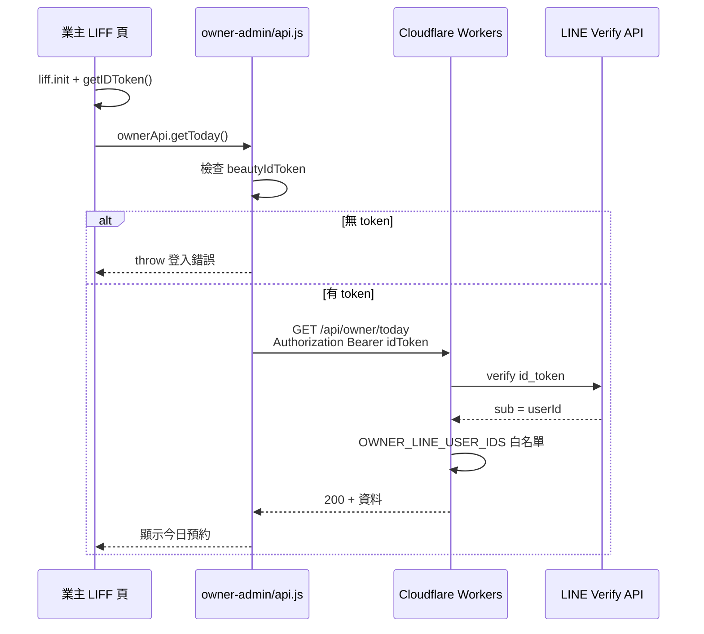

# Cursor 任務包 Phase 2：業主端前端帶入 LINE ID Token

> **專案**：`beauty-studio-booking`  
> **前置任務**：`TASK-owner-api-auth.md`（Phase 1 後端驗證）必須已完成並部署  
> **建立日期**：2026-07-12  
> **狀態**：待執行  
> **優先級**：高（與 Phase 1 配套）

---

## 1. 目標

修改業主端 JavaScript，使所有 `/api/owner/*` 請求帶上 LINE LIFF ID Token：

```
Authorization: Bearer <idToken>
```

讓 Phase 1 後端的 `requireOwnerFromRequest` 能驗證真實 LINE 身分，恢復業主管理頁正常運作。

### 現況問題（Phase 1 完成後）

| 層級 | 狀態 |
|------|------|
| 後端 | 已 fail closed，無 `Authorization` → `401` |
| 業主前端 | 仍只傳 `query/body` 的 `userId`，**不帶 ID Token** |
| 結果 | 業主管理頁所有 API 呼叫失敗 |

### 修正後應達成

1. LIFF 登入成功後，於記憶體取得 `idToken`（`liff.getIDToken()`）。
2. `owner-admin/js/api.js` 每次 owner API 請求自動帶 `Authorization: Bearer <idToken>`。
3. 若無 `idToken`，**不發送** owner API，並顯示登入錯誤（沿用既有 `#status` 區塊，不改 HTML/CSS）。
4. **不**將 token 寫死於程式碼、**不**存入 `localStorage`。
5. 同步 `owner-admin/` → `docs/owner/`，讓 GitHub Pages 上線。

---

## 2. 涉及檔案

### 必須修改

| 檔案 | 動作 | 說明 |
|------|------|------|
| `owner-admin/js/liff-init.js` | **修改** | 登入後取得 `idToken`，暴露給 API 模組 |
| `owner-admin/js/api.js` | **修改** | 所有 owner 請求帶 `Authorization`；無 token 時拒絕呼叫 |

### 同步後會變更的 docs 檔案（執行 sync 腳本產生，不手改）

| 檔案 | 說明 |
|------|------|
| `docs/owner/js/liff-init.js` | 與 `owner-admin/js/liff-init.js` 相同副本 |
| `docs/owner/js/api.js` | 與 `owner-admin/js/api.js` 相同副本 |

### 建議一併更新（快取對策，非畫面變更）

| 檔案 | 動作 | 說明 |
|------|------|------|
| `owner-admin/index.html` | **僅改 `?v=` 版本號** | 避免 LINE 內建瀏覽器快取舊 JS |
| `owner-admin/my-line-id.html` | **僅改 `?v=` 版本號** | 同上 |
| `docs/owner/index.html` | sync 後自動更新 | 由 sync 覆蓋 |
| `docs/owner/my-line-id.html` | sync 後自動更新 | 由 sync 覆蓋 |

> **注意**：`scripts/sync-github-pages.sh` 會 `rm -rf docs` 後整包複製，**不要手動改 `docs/`**；只改 `owner-admin/` 再執行 sync。

### 刻意不修改（本任務）

| 檔案 | 原因 |
|------|------|
| `owner-admin/index.html` 的 HTML 結構 | 不改畫面 |
| `owner-admin/css/style.css` | 不改畫面 |
| `owner-admin/js/app.js` | API 簽名可維持 `ownerApi.xxx(userId, ...)`；授權改由 `api.js` 內部處理 |
| `customer-ui/**` | 與本任務無關 |
| `docs/`（客人端 `docs/js/*` 等） | sync 會保留 customer-ui 副本，但不應為本任務去改 customer-ui |
| `backend/**` | Phase 1 已完成，本任務不動後端 |
| `backend/.dev.vars` | 不修改 |

---

## 3. 不可修改檔案

| 路徑 | 原因 |
|------|------|
| `customer-ui/**` | 客人端不受影響 |
| `backend/**` | 後端已在 Phase 1 完成 |
| `owner-admin/css/**` | 不改畫面 |
| `owner-admin/js/config.js` | 僅放 `LIFF_ID`、`API_BASE_URL`；不可寫入 token |
| `backend/.dev.vars` | 機密檔 |
| 手動編輯 `docs/**` | 必須透過 sync 腳本產生 |

---

## 4. 不做範圍

| 項目 | 說明 |
|------|------|
| 修改 HTML 版面 / CSS 樣式 | 錯誤訊息沿用 `#status` 文字顯示即可 |
| 修改 `owner-admin/js/app.js` | 除非驗收發現必須調整；預設不動 |
| 修改 `customer-ui` | 客人端 booking API 的 token 驗證為 Phase 3（另案） |
| 修改後端 API | Phase 1 範圍 |
| 將 token 寫入 `config.js` | 禁止 |
| `localStorage` / `sessionStorage` 存 idToken | 禁止長期儲存 |
| 修改 Notion 資料 | 測試以讀取為主 |
| 修改 `.dev.vars` | 禁止 |

---

## 5. 實作步驟

### 前置確認

- [ ] Phase 1 已部署：`/api/owner/*` 無 Bearer token 時回 `401`
- [ ] Cloudflare 已設定 `LIFF_CHANNEL_ID`（與 LINE Channel ID 一致）
- [ ] `owner-admin/js/config.js` 已填入正確 `LIFF_ID`、`API_BASE_URL`

---

### Step 1：修改 `owner-admin/js/liff-init.js`

**目標**：LIFF 初始化並登入成功後，取得 ID Token 並放在**記憶體**（`window` 變數），不寫入 `localStorage`。

**建議實作要點**：

1. 登入成功、取得 `profile` 之後，呼叫：
   ```javascript
   var idToken = liff.getIDToken();
   ```
2. 若 `idToken` 為空或 null：
   - 拋出錯誤，訊息例如：`無法取得 LINE 登入憑證，請完全關閉 LINE 後重新開啟此頁`
   - **不要** resolve `beautyLiffReady`
3. 若成功：
   ```javascript
   window.beautyIdToken = idToken;   // 僅記憶體，生命週期 = 頁面 session
   window.beautyUser = { userId, displayName, pictureUrl };  // 維持既有
   ```
4. 可選：提供唯讀存取
   ```javascript
   window.getBeautyIdToken = function () {
     return window.beautyIdToken || null;
   };
   ```
5. **保留**既有 `LOGIN_COOLDOWN_KEY` 的 localStorage 用法（僅登入冷卻時間戳，**不是** token）。
6. 登入失敗路徑維持 `__rejectBeautyLiff(error)`，讓 `app.js` 的 `boot()` 顯示錯誤。

**禁止**：
```javascript
localStorage.setItem("idToken", idToken);  // 不可
```

---

### Step 2：修改 `owner-admin/js/api.js`

**目標**：central `apiFetch` 在每次 owner API 請求帶入 Authorization；無 token 時不發 request。

#### 2.1 新增取得 token 的函式

```javascript
function getIdToken() {
  if (typeof window.getBeautyIdToken === "function") {
    return window.getBeautyIdToken();
  }
  return window.beautyIdToken || null;
}
```

#### 2.2 修改 `apiFetch`

在 `fetch` 之前：

```javascript
var idToken = getIdToken();
if (!idToken) {
  throw new Error("尚未完成 LINE 登入，無法呼叫管理 API");
}
```

合併 headers：

```javascript
headers: {
  "Content-Type": "application/json",
  "Authorization": "Bearer " + idToken
}
```

注意：若 `options.headers` 已存在，需合併而非覆蓋。

#### 2.3 調整各 owner API 方法 — 移除 query/body 的 `userId`（授權用）

Phase 1 後端已忽略 query/body `userId` 作為授權依據。Phase 2 應**停止傳送** `userId`，減少誤導與資訊洩漏。

| 方法 | 修改前 | 修改後 |
|------|--------|--------|
| `getToday(userId, date)` | `?userId=...&date=...` | `?date=...`（date 可選） |
| `getServices(userId)` | `?userId=...` | 無 query |
| `createService(userId, data)` | body 含 `userId` | body 僅業務欄位 |
| `updateService(userId, id, data)` | body 含 `userId` | body 僅業務欄位 |
| `getSlots(userId)` | `?userId=...` | 無 query |
| `saveSlots(userId, slots)` | body 含 `userId` | body 僅 `{ slots }` |
| `getSettings(userId)` | `?userId=...` | 無 query |
| `updateSettings(userId, data)` | body 含 `userId` | body 僅設定欄位 |

**函式簽名可保留** `userId` 參數（避免改 `app.js`），但函式內部**不使用**該參數組 URL/body。

範例：

```javascript
getToday: function (userId, date) {
  var query = "/api/owner/today";
  if (date) query += "?date=" + encodeURIComponent(date);
  return apiFetch(query);
},
```

#### 2.4 401 / 403 錯誤處理（建議）

當 `response.status === 401`：

```javascript
throw new Error("登入已過期，請完全關閉 LINE 後重新開啟此頁");
```

當 `response.status === 403`：

```javascript
throw new Error("無業主管理權限");
```

沿用既有 `apiFetch` 解析 `body.message` 的邏輯即可；**不需改 HTML**。

---

### Step 3：確認 `owner-admin/js/app.js` 無需修改（預設）

`app.js` 目前模式：

```javascript
await window.beautyLiffReady;
state.user = window.beautyUser;
await window.ownerApi.getToday(state.user.userId, date);
```

只要 `beautyLiffReady` 在無 `idToken` 時會 reject，且 `api.js` 在無 token 時 throw，`boot()` 既有的：

```javascript
} catch (error) {
  setStatus("error", error.message || "發生未知錯誤");
}
```

會顯示登入錯誤，**無需改畫面**。

若實作後 `beautyLiffReady` resolve 了但 token 仍為空，屬 bug，應在 Step 1 修正。

---

### Step 4：更新 JS 快取版本號（建議）

在 `owner-admin/index.html`、`owner-admin/my-line-id.html` 中，將 script 的 `?v=` 改為新值，例如：

```
?v=20260712001
```

僅改 query string，**不改 HTML 結構**。

---

### Step 5：同步到 `docs/owner/`

```bash
cd /path/to/beauty-studio-booking
./scripts/sync-github-pages.sh
```

此腳本會：

1. 刪除並重建整個 `docs/`
2. 複製 `customer-ui/` → `docs/`
3. 複製 `owner-admin/` → `docs/owner/`

**本任務會變更的 docs 路徑（明確列表）**：

```
docs/owner/js/api.js
docs/owner/js/liff-init.js
docs/owner/index.html          # 若改了 ?v=
docs/owner/my-line-id.html     # 若改了 ?v=
```

**不會因本任務直接變更**（除非 sync 整包覆蓋相同內容）：

```
docs/index.html
docs/js/*
docs/css/*
```

---

### Step 6：提交與部署

```bash
git add owner-admin/ docs/owner/
git commit -m "feat(owner-admin): 帶入 LINE ID Token 呼叫 owner API"
git push
```

等待 GitHub Pages 更新（約 1～2 分鐘），**從 LINE 完全關閉再重新開啟** LIFF 連結測試。

---

## 6. 驗收標準

### 必須通過

- [ ] `liff-init.js` 登入成功後設定 `window.beautyIdToken`（或 `getBeautyIdToken()`）
- [ ] **未**將 idToken 寫入 `localStorage` / `sessionStorage` / `config.js`
- [ ] `api.js` 的 `apiFetch` 每次請求帶 `Authorization: Bearer <idToken>`
- [ ] 無 idToken 時 `apiFetch` throw，**不發送** HTTP 請求
- [ ] 無 idToken 時使用者看到錯誤訊息（`#status` 區塊），管理功能不載入
- [ ] owner API 的 URL / body **不再傳** `userId` 作為授權參數
- [ ] 業主帳號（白名單內）從 LINE 開啟管理頁：今日預約、服務、時段、設定皆可正常載入
- [ ] 非業主 LINE 帳號開啟管理頁：顯示「無業主管理權限」或後端回傳之 `403` 訊息
- [ ] `customer-ui` 預約流程不受影響
- [ ] 已執行 `sync-github-pages.sh`，`docs/owner/js/api.js` 與 `owner-admin/js/api.js` 一致
- [ ] 未修改 `customer-ui/**`、`backend/**`

### 安全驗收（與 Phase 1 聯合）

- [ ] 僅改 `userId` query、不帶 Bearer 的 curl 請求仍回 `401`（後端未被繞過）
- [ ] DevTools Network 可見 owner 請求有 `Authorization` header
- [ ] Sources 面板中 `config.js` 無 token 字串

### 建議加強（非必須）

- [ ] 收到 `401` 時錯誤訊息提示「請重新開啟 LINE」
- [ ] `console.log` 不得輸出完整 idToken

---

## 7. 測試指令與手動驗收

### 7.1 後端仍拒絕無 token 請求（回歸 Phase 1）

```bash
export API_BASE="https://your-api.workers.dev"
export FAKE_OWNER_ID="Uxxxxxxxx"

curl -s -w "\nHTTP %{http_code}\n" \
  "$API_BASE/api/owner/today?userId=$FAKE_OWNER_ID"
```

**預期**：`401`（證明僅傳 userId 仍無法突破）

---

### 7.2 後端接受有效 Bearer token

```bash
# 從業主 LIFF 頁 Console 取得：liff.getIDToken()
export OWNER_ID_TOKEN="eyJhbG..."

curl -s -w "\nHTTP %{http_code}\n" \
  -H "Authorization: Bearer $OWNER_ID_TOKEN" \
  "$API_BASE/api/owner/today"
```

**預期**：`200`

---

### 7.3 瀏覽器手動驗收 — 業主成功路徑

1. 從 LINE 開啟業主 LIFF：`https://liff.line.me/<LIFF_ID>/owner/`（或 GitHub Pages 對應網址）
2. 開啟 DevTools → Network
3. 重新整理或切換分頁觸發 API
4. 檢查 `/api/owner/today` 請求：
   - Request Headers 含 `Authorization: Bearer eyJ...`
   - **無** `userId` query 參數
   - Status `200`
5. 畫面顯示今日預約區塊正常（有資料或「今日尚無預約」）

---

### 7.4 瀏覽器手動驗收 — 無 token 不發請求

**模擬方式**（僅開發環境）：暫時在 Console 執行：

```javascript
window.beautyIdToken = null;
```

再點「重新整理」按鈕。

**預期**：

- Network **不出現** 新的 `/api/owner/*` 請求，或
- 在 `apiFetch` 層即 throw，畫面 `#status` 顯示「尚未完成 LINE 登入…」

---

### 7.5 瀏覽器手動驗收 — 非業主帳號

1. 使用不在 `OWNER_LINE_USER_IDS` 的 LINE 帳號開啟業主頁
2. **預期**：`403`，畫面顯示無權限相關錯誤

---

### 7.6 瀏覽器手動驗收 — 客人端未受影響

1. 從 LINE 開啟客人預約頁
2. 服務列表、選日期、選時段流程正常
3. Network 中 `/api/services` **無** `Authorization` header（客人端尚未做 token）

---

### 7.7 檢查 localStorage

DevTools → Application → Local Storage：

**預期**：

- 僅有 `beauty-liff-login-at`（登入冷卻用，可存在）
- **無** `idToken`、`beautyIdToken` 等 key

---

### 7.8 檢查 docs 同步

```bash
diff owner-admin/js/api.js docs/owner/js/api.js
diff owner-admin/js/liff-init.js docs/owner/js/liff-init.js
```

**預期**：無差異（或僅 sync 前尚未執行時有差異，sync 後應一致）

---

## 8. 風險

| 風險 | 嚴重度 | 說明 | 緩解 |
|------|--------|------|------|
| Phase 1 未部署就發 Phase 2 | 高 | 前端帶 token 但後端不驗證，或後端已 fail closed 但前端未更新 | 確認 Phase 1 已上線再部署 Phase 2 |
| LINE 快取舊 JS | 高 | 業主仍跑舊版 `api.js`，不帶 token | 更新 `?v=`；從 LINE 完全關閉再開 |
| ID Token 過期 | 中 | 長時間開著頁面後 API 變 401 | 顯示「請重新開啟 LINE」；使用者重開 LIFF |
| CORS preflight 失敗 | 低 | 加 Authorization 觸發 OPTIONS | Phase 1 已允許；若失敗檢查後端 CORS |
| 誤改 `app.js` 造成連鎖 | 低 | 範圍擴大 | 本任務限定只改 `liff-init.js`、`api.js` |
| sync 覆蓋 docs 時遺失手改 | 中 | 有人手改 `docs/owner` | 一律只改 `owner-admin/` 再 sync |

---

## 9. Rollback 方式

### 9.1 僅回復 Phase 2 前端

```bash
git checkout HEAD~1 -- owner-admin/js/api.js owner-admin/js/liff-init.js
# 若有改 index.html 的 ?v=
git checkout HEAD~1 -- owner-admin/index.html owner-admin/my-line-id.html

./scripts/sync-github-pages.sh
git add owner-admin/ docs/owner/
git commit -m "revert: owner-admin ID Token 前端變更"
git push
```

### 9.2 Revert commit

```bash
git revert <phase2-commit-sha>
./scripts/sync-github-pages.sh
git push
```

### 9.3 回復後狀態

| 組合 | 業主頁行為 |
|------|-----------|
| Phase 1 後端 + 回復 Phase 2 前端 | 業主 API 全部 `401`，管理頁無法使用 |
| 回復 Phase 1 後端 + 保留 Phase 2 前端 | 後端可能仍信任 userId（若 Phase 1 也回復），前端多帶 Bearer 通常仍可用 |

**建議**：若需暫時恢復營運且尚未完成 Phase 2，需同時回復 Phase 1 後端（見 `TASK-owner-api-auth.md` 第 9 節）— 但會恢復安全漏洞。

### 9.4 不需 rollback 的項目

- Notion 資料（本任務不應寫入測試髒資料）
- `backend/.dev.vars`
- `customer-ui`

---

## 10. 與 Phase 1 的銜接



---

## 附錄 A：給 Cursor Agent 的執行提示詞

```
請閱讀 beauty-studio-booking/TASK-owner-api-auth-phase2.md，嚴格依任務包執行。

重點：
1. 只改 owner-admin/js/liff-init.js、owner-admin/js/api.js
2. 可改 owner-admin/index.html、my-line-id.html 的 ?v= 版本號（不改 HTML 結構）
3. 不要改 customer-ui、backend、owner-admin/js/app.js、owner-admin/css、config.js
4. LIFF 登入後用 liff.getIDToken() 存記憶體（window.beautyIdToken），禁止 localStorage 存 token
5. api.js 每次 owner API 帶 Authorization: Bearer <idToken>；無 token 不發請求
6. 移除 owner API URL/body 中的 userId 參數（函式簽名可保留 userId 以相容 app.js）
7. 完成後執行 ./scripts/sync-github-pages.sh，確認 docs/owner/js/api.js 與 liff-init.js 已同步
8. 不要手動改 docs/ 其他檔案
```

---

## 附錄 B：現況程式碼錨點

### `liff-init.js` — 目前未取得 idToken

```95:103:owner-admin/js/liff-init.js
    var profile = await liff.getProfile();
    window.beautyUser = {
      userId: profile.userId,
      displayName: profile.displayName || "業主",
      pictureUrl: profile.pictureUrl || ""
    };
    if (window.__resolveBeautyLiff) {
      window.__resolveBeautyLiff();
```

**缺少**：`liff.getIDToken()` 與 `window.beautyIdToken`

---

### `api.js` — 目前僅傳 userId、無 Authorization

```16:23:owner-admin/js/api.js
  async function apiFetch(path, options) {
    var baseUrl = getApiBaseUrl();
    if (!baseUrl) {
      throw new Error("API 尚未設定");
    }
    var response = await fetch(baseUrl + path, Object.assign({
      headers: { "Content-Type": "application/json" }
    }, options || {}));
```

```40:43:owner-admin/js/api.js
    getToday: function (userId, date) {
      var query = "/api/owner/today?userId=" + encodeURIComponent(userId);
      if (date) query += "&date=" + encodeURIComponent(date);
      return apiFetch(query);
```

---

## 附錄 C：docs 同步影響範圍一覽

| 操作 | 影響路徑 |
|------|----------|
| 修改 `owner-admin/js/api.js` | sync → `docs/owner/js/api.js` |
| 修改 `owner-admin/js/liff-init.js` | sync → `docs/owner/js/liff-init.js` |
| 修改 `owner-admin/index.html` | sync → `docs/owner/index.html` |
| 修改 `owner-admin/my-line-id.html` | sync → `docs/owner/my-line-id.html` |
| 修改 `owner-admin/css/*` | sync → `docs/owner/css/*`（本任務不應改） |
| 不修改 `customer-ui/` | sync 後 `docs/` 根目錄仍為 customer-ui 副本 |

---

*任務包版本：1.0｜前置：TASK-owner-api-auth.md Phase 1*
